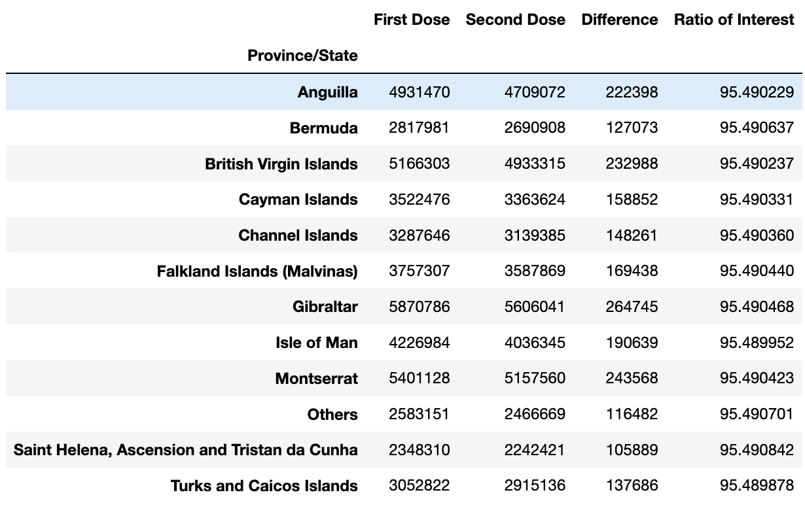
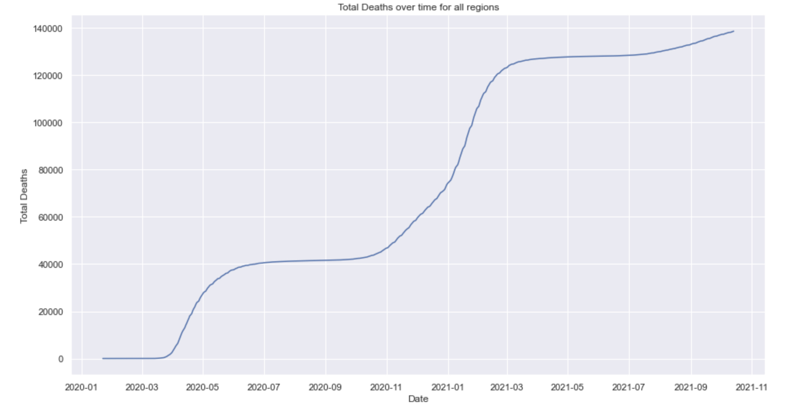
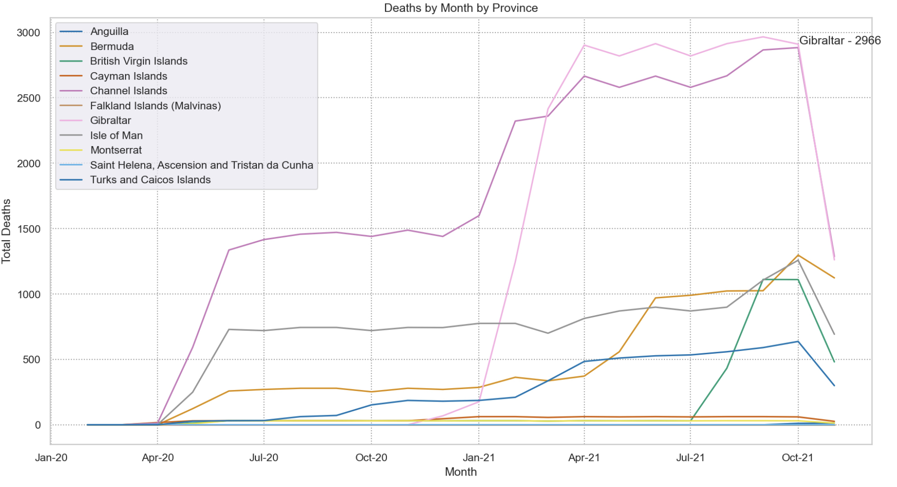
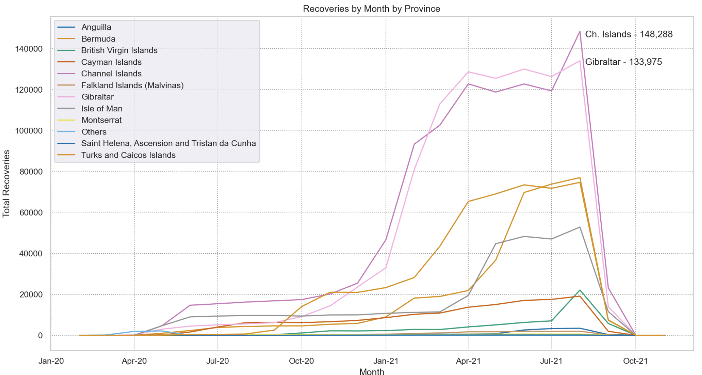
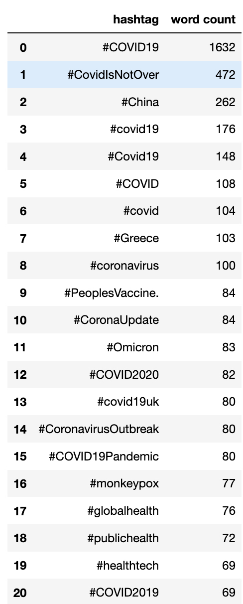

<!DOCTYPE html>
<html>
<head>
  <link rel="stylesheet" href="https://github.com/styles.css" type="text/css">
 </head>
<body>
<h1>
LSE Course - Module 2 Covid Analysis</h1>

<h2>Scenario</h2>

The UK government have requested an analysis of data to help with a marketing campaign with the intention of increasing uptake of the vaccination.
As part of this analysis, the government wants to review trends and patterns that will help with the successful outcome of the marketing campaign.

The key outputs that the government is looking for are: 

- <b>Total</b> vaccinations (1st dose, 2nd dose) in total and overtime per region 
- Where they should target the first marketing campaign based on:  
  -  Largest area with 1st dose but no 2nd dose. 
  -  area which has the greatest number of recoveries so that they can be excluded from the campaign.  
  -  whether deaths have been increasing across all regions or if a peak has been reached.  
-  Which regions have experienced a peak in hospitalisation numbers and if there are regions which have not yet peaked.
-  What other Twitter data points and tweets have both #coronavirus and #vaccinated hashtags.
  
<h2>Approach & Insights</h2>
<h3> Data Summary</h3>

Three DataFrames were created to review the COVID data provided, focusing mainly on the number of cases, the vaccination status' and the twitter posts which included hashtags based around covid tags.
  

There was some interesting insights of the cases data, whereby, the column headers are infurring an infection (Cases, Hospitalised) and a resolution (Recovered or Death). However, there would be an expected aggregated correlation between the hospitalised and cases (either they match or the aggregated number of cases is higher to account for those who have either died or have recovered). In the Gibraltar case, on 27/03/2020 - there were 908 hospitalisations but only 216 total cases, of which 57 had recovered, so there is further investigation required as to whether the 908 were hospitalised with Covid or for other reasons.
 

Similarly within the Gibraltar data, there is a wave like pattern for hospitalisations. This potentially coinciding with the vaccination drive leading to lower admissions, before the introduction of a new variant strain. The last two records provide interesting reading, potentially indicating a failure to record rather than a sudden drop to 0 for hospitalisations.
 

<h3>Vaccination Uptake</h3>

It is noted that uptake of the second dose is high, with all areas of the UK having a second dose uptake ratio of above 95% against the take up of the first dose. What the figures don't show us is the total population of the Province and therefore, whilst the data shows us that those who have taken the first dose, the uptake of the second dose amongst them is high. It cannot currently be compared against the population which should be the next investigative route.
 

 The highest Province take up of the vaccination is Gibraltar but as previously mentioned, without a total population, it is not clear as to whether this number is high for the Province or not. It also has the biggest variance between the first and second dose with a difference of 264,745.

<h3>Cases and Deaths</h3>

The number of cases across the entire United Kingdom territory shows that the number of deaths has not peaked but also that those Provinces which are categorised as 'Other' skew the data significantly, so as to make the visualisation of all of the other Provinces difficult to show anything meaningful.
Interestingly, we see that most Provinces follow the same trajectory, an initial spike, followed by a levelling off, before a further spike and a second levelling off.
 

When the 'Others' province is removed, we gain the ability to review the deaths for the other provinces in a more granular level of detail.It is important to note that the downward trend in November 2021 would appear to be due to a lack of data rather than evidence of a downturn in deaths.
 

<h3>Recoveries</h3>

The number of recoveries per Province is also showing as would be expected for an unknown virus of this kind. A slow rise in number of those recovering whilst authorities are trying to identify the best way to treat those who have been infected, then a high rise in recoveries after the vaccinations are introduced to the populus and more is known on the best way to treat. It would be good to overlap the death rates with the recovery rates to see if the deaths and recoveries counter each other i.e. we see the death rates fall whilst recoveries increase.

  
<h3>Social Media</h3>

Social media understandably has formed part of governmental strategy to update the population on vaccination progress, deaths, recovery and policy. Interestingly, the top trending twitter hashtags all have COVID or a variation of, in them. It is interesting that there are not any hashtags which refer to government decisions, lockdowns or the NHS which might have been expected.It would be interesting to find out how the public perceive the government reponse to COVID as this would form part of the input into deciding where to focus their next vaccination drive but also determine if there are actions to take to improve the perception, resulting in a higher uptake.
 

<h2>Additional Exploration</h2>

To further the analysis, it would also be good to identify some of the following: 
<ls>if the data being provided was a rolling aggregated number of cases or if it was the number of cases reported that day. This would be an important distinction for the trend analysis.
 

